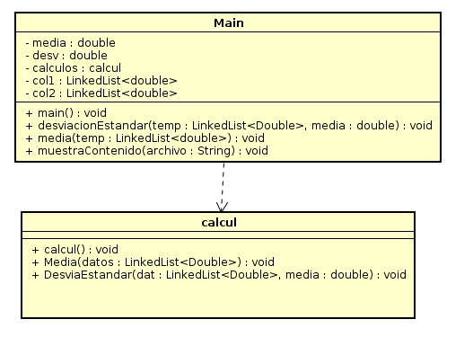

# TAREA 1 AREM Descripcion

El siguiente codigo representa la implementacion para dado un archivo .txt con un conjunto de datos nos regrese tanto
la media de ese conjunto de datos como la desviacion estandar.

Es realizado en maven Java .
La siguiente aplicacion toma los valores de un documento .txt y obtiene la mediana y desviacion estandar de esos datos.

A continuacion se muestra una imgaen de un diagrama de la aplicacion.

 
 
 # Utilizar el Proyecto
 Si desea utilizar el proecto lo que debe realizar es copiarlo del repositorio en git, pegando el siguiente texto que descargara una copia de git y lo almacenara en su directorio:
 
 ```
git clone https://github.com/arem2019-1/Trabajo1
```

### Prerequisitos

Tener instalado Java jdk versiones 7+, Maven comandos y git

### Instalando

1. Ejecutar en terminal:

```
$$ mvn package
```
2.(opcional):
si requiere a documentacion del codigo ejecute y estara en raiz /target:

```
mvn javadoc:javadoc
```

2. (Demostracion):
  compile el proyecto desde la carpeta raiz ejecutando la siguiente linea:
  
```
java -cp target/TareaMVNGit-1.0-SNAPSHOT.jar edu.escuelaing.arem.ASE.app.App
```
  le mostrara la media y desviación estandar del ejemplo de la Tabla 1 del ejercicio
  
  
  
  

## Built con

* [Maven](https://maven.apache.org/) - Dependency Management
* [JAVA JDK 8](http://www.oracle.com/technetwork/java/javase/overview/index.html) - construcción

## Autor
* **CESAR EDUARDO LANOS CAMACHO** - *Initial work* - [cefarr](https://github.com/cefarr)

## Licencia

This project is licensed under the GNU General Public License - see the [LICENSE](LICENSE) file for details